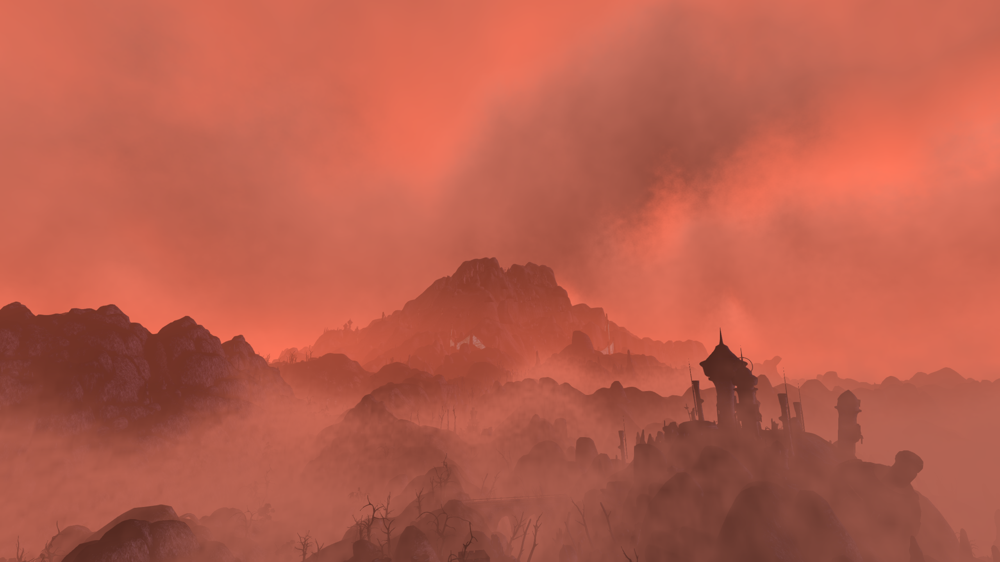

# pharis-mod-list

# Before We Start

This list is for [**OpenMW**](https://openmw.org/downloads/) but with few exceptions it will work fine on the original engine. I am putting this list together to hopefully make the process of modding this wonderful game easier, but please don't ask questions that are answered in the mod's readme, description, or god forbid even the title. Lastly, this is not a tutorial for installing **OpenMW** or for **MO2**; I will gladly help as best I can on Discord(**Pharis#2588**) but there are great resources with that information readily available so it would seem redundant(and tiresome) to repeat here.

### My System
For reference this is what I am currently using to play **OpenMW**: 
System | My Specs
------------- | -------------
OS | Windows 11 Pro 64-bit
CPU | Intel Core i5 12600k
RAM | 16GB DDR4
GPU | EVGA 2080 Super Black
SSD | Crucial P5 Plus NVME SSD 500GB
Monitor | Dell s2721dgf

With this mod list my FPS is always above 60(even in Old Ebonheart) with 25 cell view distance.

Click [**here**](config/settings.cfg) for my my full settings.cfg file

Click [**here**](modlist.md) to get started

