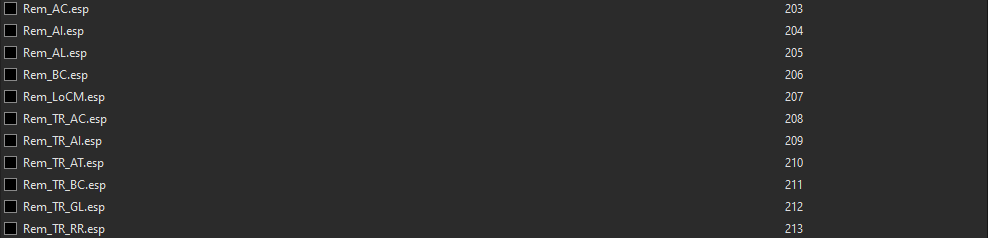

# Finishing Up

Before running mlox or TES3Merge make sure no grass plugins are active in your load order. They should be visible in the right pane but deactivated, as shown below.



## Sorting Load Order
While it is entirely possible to sort your load order manually, and some stubborn few still do, it's a lot of trial and error with large modlists that just isn't worth the time. 

As explained in the Preamble, **mlox** should be in your MO2 executables list. Run **mlox** through MO2.

## Merged Patches
Merging objects and levelled lists automatically solves many incompatibilities between mods and it is an essential part of maintaining a functioning load order. Both of these patches will be handled by **TES3Merge**, as since its latest update it supercedes the tes3cmd multipatch. 

As explained in the Preamble, you should have **TES3Merge** installed and added to your MO2 executables. Simply run **TES3Merge** through MO2. If using OpenMW, now is the time to use the export plugin.

## Addendum

Now that you've merged levelled lists and objects, sorted your load order, and (if on OpenMW) exported your mods create a test character and run around looking for any potential issues before starting a playthrough.

## Troubleshooting Mods

All mods on this list are compatible with eachother but other mods may conflict. If you have a question about what a mod does or any potential incompatabilities with other mods not on this list:

- Read the Nexus description
- Read the mod's Readme
- Check in-game on a new save for obvious issues (buildings placed inside of eachother, floating doors, etc)

Only after doing the three steps above should you go around asking others.

If you notice a bug with a mod:

- Disable any potentially conflicting mods, safest choice is to disable all mods that you aren't testing 
- Start a new character, preferably with a quickstart mod such as the one on this list
- Reproduce the bug
- If it's a misplaced object (floaters, z-fighting, etc), use the `ori` command on the object and take a screenshot

Only after doing these steps should you report a bug to the mod author (in the *BUGS* section, not *POSTS*) with any screenshots included and a detailed explanation of what the issue is, remember the mod author has to be able to reproduce it or find the issue in-game or they can't fix it.

----

## Activating Groundcover **[*OpenMW Only*]**

**Important Note: Do not activate grass plugins in the right pane of MO2 or in the OpenMW launcher, do not add content lines for groundcover plugins in openmw.cfg**

Add the following lines to your **settings.cfg**:
```
[Groundcover]
enabled = true
density = 1.0
min chunk size = 0.5
stomp mode = 2
stomp intensity = 1
rendering distance = 12288
```
Stomp intensity can be lowered to zero to disable stomping entirely and density can be lowered if desired.

Add the following lines to your **openmw.cfg**:
```
#Vanilla
groundcover=Rem_BC.esp
groundcover=Rem_AC.esp
groundcover=Rem_AL.esp
groundcover=Rem_AI.esp
groundcover=Rem_WG.esp
groundcover=Rem_GL.esp
groundcover=Rem_GL - OAAB Landscape.esp

#Tamriel Rebuilt
groundcover=Rem_TR_AC.esp
groundcover=Rem_TR_AI.esp
groundcover=Rem_TR_AT.esp
groundcover=Rem_TR_BC.esp
groundcover=Rem_TR_GL.esp
groundcover=Rem_TR_RR.esp
groundcover=Rem_TR_WG.esp

#TR Preview
groundcover=Rem_TRp_AI.esp
groundcover=Rem_TRp_AL.esp
groundcover=Rem_TRp_AT.esp
groundcover=Rem_TRp_BC.esp
groundcover=Rem_TRp_GL.esp
groundcover=Rem_TRp_GM.esp
groundcover=Rem_TRp_RR.esp
groundcover=Rem_TRp_Sol.esp
groundcover=Rem_TRp_TV.esp
groundcover=Rem_TRp_WG.esp

#Skyrim Home of the Nords
groundcover=Sky_Main_Grass.esp

#Solstheim - Tomb of the Snow Prince
groundcover=VSW-Rem-Anthology Solstheim.esp

#Landscape Overhaul for Lokken Mountain
groundcover=Rem_Lokken_RP_Grass.esp

#Legend of Chemua Moved
groundcover=Rem_LoCM.esp
```
