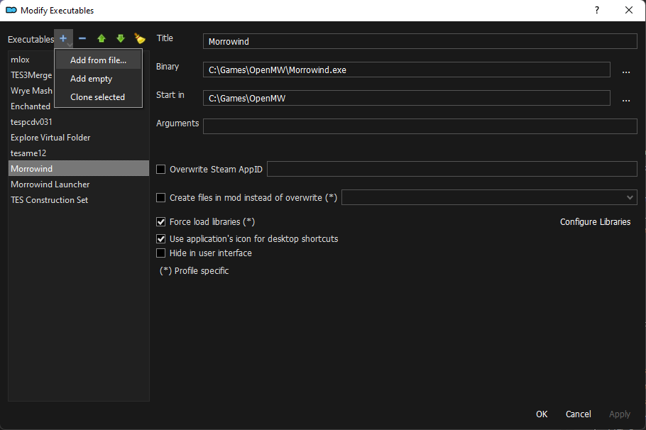
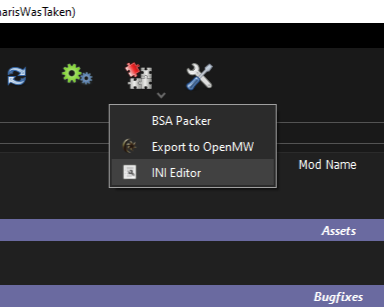
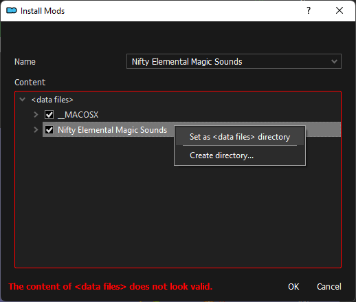

[<< Back to Preamble](preamble.md)

# MO2 Basics

Mod Organizer 2 is a wonderdul mod manager (not sponsored trust me) that makes adding, removing, and reordering mods very easy while maintaining a pristine vanilla install (except for MGE XE and a few other things of course).

**Lucas**, the author of Morrowind Sharp, also put together a modding tips document [**here**](https://github.com/Sigourn/moddingtips.md/blob/main/README.md), I recommend you give it a read.

I will gladly help as best I can on Discord (**Pharis#2588**) if you have any other issues that aren't clearly explained here.

## Installation
To install Mod Organizer go to the Nexus page [**here**](https://www.nexusmods.com/skyrimspecialedition/mods/6194?tab=files) and click on **Manual Install** below the Main File.

Run the installer, accept the agreements, choose recommended install, and either use the default directory or pick your own.

## Creating an Instance
When you launch MO2 for the first time you will be prompted to create an instance. An instance is where all of the mods, downloaded archives, and configuration files for a managed game are stored. Create a Global Instance and navigate to your Morrowind installation when prompted to choose a managed game.

## Creating a Separator
To keep a long list of mods organized you're going to need separators. To create a separator right click on the left pane below the overwrite folder and select **Create Separator** in the context menu.

I would also recommend right clicking on the separator and choosing **Select Color** to choose a better color.

## Adding an Executable
To add an executable to MO2 click on the dropdown in the top right that displays your currently selected exe and select **Edit**. In the **Modify Executables** window click on the plus icon at the top and select **Add from file**, lastly navigate to the exe that you want to add and double click it. Be sure to hit apply after changing anything in the **Modify Executables** window so that your changes are saved. 

> 

## Profile Specific INI
**MO2** uses it's own ini for Morrowind instead of the one in the game directory. The profile-specific **Morrowind.ini** in **MO2** can be accessed by clicking on the puzzle icon in the top left of the screen and selecting **INI Editor**.

 > 
<!--
## Incorrectly Packaged Mods

> 
-->
