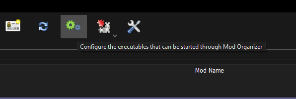
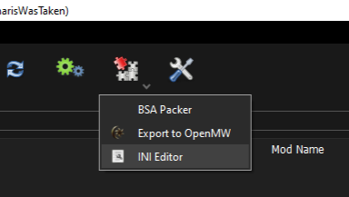
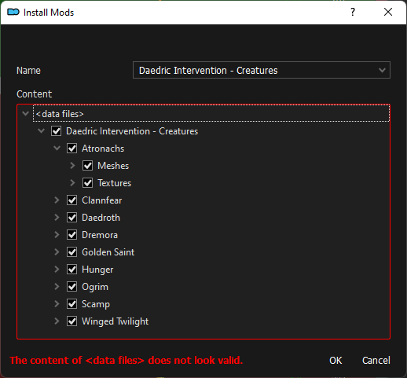
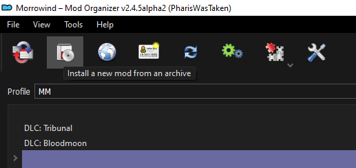

[<< Back to Preamble](preamble.md)

# MO2 Basics

Mod Organizer 2 is a wonderdul mod manager (not sponsored trust me) that makes adding, removing, and reordering mods very easy while maintaining a pristine vanilla install (except for MGE XE and a few other things of course).

**Sigourn**, the author of Morrowind Sharp, also put together a general modding tips document [**here**](https://github.com/Sigourn/moddingtips.md/blob/main/README.md), I recommend you give it a read.
<!--
I will gladly help as best I can on Discord (**Pharis#2588**) if you have any other issues that aren't clearly explained here.
-->
## Installation
To install Mod Organizer go to the Nexus page [**here**](https://www.nexusmods.com/skyrimspecialedition/mods/6194?tab=files) and click on **Manual Install** below the Main File.

- Run the installer
- Accept the agreements 
- Choose recommended install 
- Either use the default directory or pick your own

## Creating an Instance
When you launch MO2 for the first time you will be prompted to create an instance. An instance is where all of the mods, downloaded archives, and configuration files for a managed game are stored.

- Create a Global Instance 
- Navigate to your Morrowind directory
- Select `Morrowind.exe` when prompted to choose a managed game

## Terminology
MO2 - Mod Organizer 2 shortened for convenience

VFS - Virtual file system, how MO2 avoids messing with your vanilla install and why you need to launch programs through its interface

Pane - MO2 is separated into two sections mods in the left pane, load order in the right

Archive - The zip, 7z, etc file that a mod is packaged in

Directory - The folder something is located in

## Creating a Separator
To keep a long list of mods organized you're going to need separators.

To create a separator, 

either:

- Right click on the left pane below the overwrite folder 
- Select **Create Separator** in the context menu

or:

- Right click on any mod
- Select **All Mods**>**Create separator above**

I would also recommend right clicking on the separator and choosing **Select Color** to choose a better color.

## Hiding Files
Files and folders can be hidden so that they won't overwrite other mods. 

To hide a file or folder:

- Double click on the mod
- Go to **Filetree** tab
- Right click on the file or folder
- Select **Hide** in the context menu

Files that are hidden will be appended with ".mohidden".

To unhide a file or folder:
- Right click on the file or folder
- Select **Unhide** in the context menu

## Adding an Executable
Third party programs such as TES3Merge, mlox, Enchanted Editor, etc will need to be run through MO2 in order for them to have access to its vfs and therefore be able to see your mods.

To add an executable to MO2:

- Click on either the dropdown in the top right that displays your currently selected exe or the gear icon in the top left
- Select **Edit**
- In the **Modify Executables** window click on the plus icon at the top
- Select **Add from file**
- Navigate to the exe that you want to add and double click it
> 

## Profile Specific INI
**MO2** uses it's own ini for Morrowind instead of the one in the game directory. The profile-specific **Morrowind.ini** in **MO2** can be accessed by clicking on the puzzle icon in the top left of the screen and selecting **INI Editor**.

 > 
<!--
> 

> 
-->
Be sure to hit apply after changing anything in the **Modify Executables** window so that your changes are saved. 
## Profile Specific INI
**MO2** uses it's own ini for Morrowind instead of the one in the game directory. The profile-specific **Morrowind.ini** in **MO2** can be accessed by clicking on the puzzle icon in the top left of the screen and selecting **INI Editor**. This profile-specific ini is the one you should edit.

 > 

## Incorrectly Packaged Mods
Some mods are improperly packaged and therefore cannot simply be installed in a click of a button. The most common type of incorrectly packaged mods is the Data Files being one folder too deep as shown below.

> 

To solve this issue:
- Verify that the folder structure in the directory is correct (contains Textures, Meshes, MWSE, etc)
- Right click on the folder
- Select **Set as <data files\> directory**
- Install

Some mods are even more egregious in their packaging, such as the one shown below.

This mod has the assets for each creature type separated into different folders but it isn't formatted for a BAIN installation, resulting in a mess of Data Files directories. 

To solve this issue:
- Take the `Meshes` and `Textures` folders from each data directory (data directory = creature folders) and drag them up to **<data files\>** 
- Unselect each, now empty, data directory
- Install
<!--
## Downloading Multiple Mods From The Same Page

## Installing Mods From Archives

-->
## Overwrite Folder
The Overwrite folder is consistently a source of confusion for new MO2 users and it doesn't help that for as long ad there are files in your Overwrite folder, which will in all likelihood always be the case, MO2 will have a warning message in the top right that won't go away.

To clear a few things up:

- There is no issue with having files in the Overwrite folder
- For all intents and purposes the Overwrite folder is treated like any other mod by MO2 and it is loaded after every other mod (hence the name)
- Files created by programs run through MO2 get sent to the Overwrite folder by default (this behavior can be changed on a per-exe basis)
<!--
To change the destination of files generated by a program:

- Go to the **Modify Executables** window
- Select the executable on the left side of the window 
- 

## Optional ESPs
Rather than hide ESPs you can put them in an optional folder to stop them from overwriting anything or appearing in your load order.
-->

