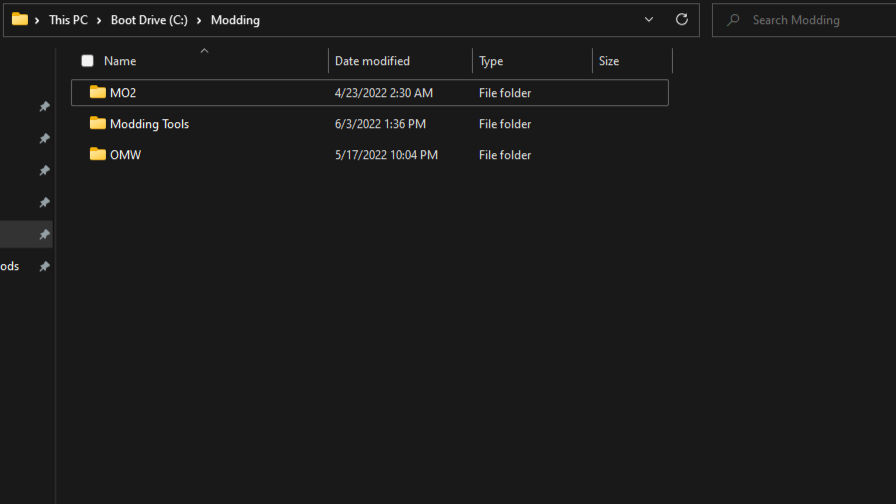

# Jump to Separator
- [**Assets**](https://github.com/PharisMods/pharis-mod-list/edit/main/modlist.md#assets)
- [**Fixes**](https://github.com/PharisMods/pharis-mod-list/edit/main/modlist.md#fixes)
- [**UI**](https://github.com/PharisMods/pharis-mod-list/edit/main/modlist.md#ui)
- [**Lua**](https://github.com/PharisMods/pharis-mod-list/edit/main/modlist.md#lua)
- [**Audio**](https://github.com/PharisMods/pharis-mod-list/edit/main/modlist.md#audio)
- [**Landmasses**](https://github.com/PharisMods/pharis-mod-list/edit/main/modlist.md#landmasses)
- [**Cell Edits & Overhauls**](https://github.com/PharisMods/pharis-mod-list/edit/main/modlist.md#cell-edits--overhauls)
- [**Mesh & Texture Replacers**](https://github.com/PharisMods/pharis-mod-list/edit/main/modlist.md#mesh--texture-replacers)
- [**Body & Head Replacers**](https://github.com/PharisMods/pharis-mod-list/edit/main/modlist.md#body--head-replacers)
- [**Creatures**](https://github.com/PharisMods/pharis-mod-list/edit/main/modlist.md#creatures)
- [**Apparel & Weapons**](https://github.com/PharisMods/pharis-mod-list/edit/main/modlist.md#apparel--weapons)
- [**NPCs & Companions**](https://github.com/PharisMods/pharis-mod-list/edit/main/modlist.md#npcs--companions)
- [**Dialogue**](https://github.com/PharisMods/pharis-mod-list/edit/main/modlist.md#dialogue)
- [**Levelled Lists**](https://github.com/PharisMods/pharis-mod-list/edit/main/modlist.md#levelled-lists)
- [**Gameplay**](https://github.com/PharisMods/pharis-mod-list/edit/main/modlist.md#gameplay)
- [**Rebalance**](https://github.com/PharisMods/pharis-mod-list/edit/main/modlist.md#rebalance)
- [**Quests**](https://github.com/PharisMods/pharis-mod-list/edit/main/modlist.md#quests)
- [**Grass**](https://github.com/PharisMods/pharis-mod-list/edit/main/modlist.md#grass)

# Utilities

These are programs that are either necessary for this mod list or very helpful in modding and troubleshooting in general. Personally, I have **MO2** in my ```Modding``` Folder and the rest in a ```Modding Tools``` directory within the same folder.



## Necessary

### Mod Organizer 2([MO2](https://www.nexusmods.com/skyrimspecialedition/mods/6194?tab=files), [OpenMW Plugin](https://www.nexusmods.com/morrowind/mods/45642?tab=files))

For modding **OpenMW** I use **Mod Organizer 2** with the [**ModOrganizer-to-OpenMW**](https://www.nexusmods.com/morrowind/mods/45642*) plugin made by **AnyOldName3**. This is the method I recommend because it is the neatest and allows the user to more easily tweak their mod list as well as run third party programs crucial to a functioning load order. 

*Do not manually install mods, I will be very disappointed in you.*

### [Mlox](https://github.com/rfuzzo/mlox) ([Latest Rules](https://github.com/DanaePlays/mlox-rules/tree/main))

This is for analyzing and sorting your load order using a set of ordering rules.

Add to your **MO2** executables list. When you run **mlox** for the first time it will create an ```mlox_base.txt``` file in ```C:\Users\<your user name>\AppData\Local\mlox\mlox```, this directory is where the latest ```mlox_user.txt```(link above) will go. Optionally also add ```-n -u``` to the arguments field to stop **mlox** from checking online and opening the GUI. 

### [tes3merge](https://www.nexusmods.com/morrowind/mods/46870) ([.NET 6 Runtime](https://dotnet.microsoft.com/en-us/download))

A tool for automatically patching conflicts between mods by merging changes to objects. For a more detailed description refer to the Nexus page.

Add to your **MO2** executables list.

### [Wrye Mash Polemos Fork](https://www.nexusmods.com/morrowind/mods/45439)

**Wrye Mash** is a mod manager specifically for Morrowind but we won't be using it to manage mods with this list, instead it will be used to merge levelled lists. Install location is irrelevant, as you will tell **Wrye Mash** where to find your Morrowind directory during the installation process. 

Add to your **MO2** executables list.

## Not Technically Necessary But Still Get Them
<details>
<p>

### [Enchanted Editor](https://mw.modhistory.com/download-95-1662)

### [TESPCD](https://mw.modhistory.com/download-95-5283)

**TESPCD** is for detecting conflicts between plugins, such as when two mods edit the same cell.

### [Nifskope](https://github.com/niftools/nifskope/releases/download/v2.0.dev7/NifSkope_2_0_2018-02-22-x64.7z) ([VC++ 2015 Redistributable](https://www.microsoft.com/en-us/download/details.aspx?id=52685))

### [Ordenator](https://www.nexusmods.com/newvegas/mods/46074?tab=description) ([Required](http://www.microsoft.com/download/en/details.aspx?id=17718))

### [7-Zip](https://www.7-zip.org/)

### [Notepad++](https://notepad-plus-plus.org/downloads/v7.9.5/)

</p>
</details>

----

# Before We Start Pt. II

Before moving on to the mod installation be sure to get all of the necessary utilities installed. Multiple mods listed have groundcover plugins, if you don't plan on using groundcover simply skip these and everything under the [**Grass**](https://github.com/PharisMods/pharis-mod-list/edit/main/README.md#grass) section. 

The mods are in order and organized by separator.

# Assets		[<sub><sup>^</sup></sub>](https://github.com/PharisMods/pharis-mod-list/edit/main/modlist.md#jump-to-separator)

These are just assets that are used for many other mods such as Tamriel Rebuilt, SHOTN, BCOM, etc.

### [Tamriel Data HD](https://www.nexusmods.com/morrowind/mods/44537?tab=description)
Add the following lines to **openmw.cfg**
```
fallback-archive=PT_Data.bsa
fallback-archive=TR_Data.bsa
```

### [OAAB Data](https://www.nexusmods.com/morrowind/mods/49042)

### [An Addendum to Tamrielic Lore Data](https://www.nexusmods.com/morrowind/mods/50647)
Get the HD textures

# Fixes		[<sub><sup>^</sup></sub>](https://github.com/PharisMods/pharis-mod-list/edit/main/modlist.md#jump-to-separator)

### [Patch for Purists](https://www.nexusmods.com/morrowind/mods/45096)

### [Unofficial Morrowind Plugins Patched](https://www.nexusmods.com/morrowind/mods/43931)
Download:
- **Main File**
	- [x] adamantium armor compatibility

If you want to use the Siege at Firemoth official plugin use the one from **BCOM - Patches**.

### [Expansion Delay](https://www.nexusmods.com/morrowind/mods/47588)

### [Dubdilla Location Fix](https://www.nexusmods.com/morrowind/mods/46720)

### [Divayth Fyr Puzzle Fixed](https://www.nexusmods.com/morrowind/mods/45155)
Download:
- **Main File**
	- [x] Pfp

### [Adamantium Ore Fix(PFP Edit)](https://github.com/Sigourn/morrowindsharp/blob/master/mods/Adamantium%20Ore%20Fix%20(PfP%20Edit).7z)

# UI		[<sub><sup>^</sup></sub>](https://github.com/PharisMods/pharis-mod-list/edit/main/modlist.md#jump-to-separator)

### [TrueType Fonts for OpenMW](https://www.nexusmods.com/morrowind/mods/46854)
This will make the text in-game much sharper and easier on the eyes, installed outside of **MO2**.

Place everything in the ```Fonts``` folder into ```"C:\"your OpenMW directory"\resources\mygui"```

### [Kezyma's UI Remastered](https://www.nexusmods.com/morrowind/mods/48987)

### [Morrowind Enhanced Textures - UI](https://www.nexusmods.com/morrowind/mods/46221)

### [De-outlandered main menu and Daedric UI textures](https://www.nexusmods.com/morrowind/mods/46805)

### [RFD's Splash Screens](nexusmods.com/morrowind/mods/47400)

### [Faithful HD Cursors](https://www.nexusmods.com/morrowind/mods/50764)

### [Better Morrowind Crosshair](https://www.nexusmods.com/morrowind/mods/50873)

### [Big Icons](https://www.nexusmods.com/morrowind/mods/49662)

### [Magic Icons(Sigourn Edit)](https://www.nexusmods.com/morrowind/mods/50223)

# Lua		[<sub><sup>^</sup></sub>](https://github.com/PharisMods/pharis-mod-list/edit/main/modlist.md#jump-to-separator)

**Disclaimer: Lua is currently only available on 0.48 Dev builds and breaking changes are a possibilty**

### [Attend Me](https://www.nexusmods.com/morrowind/mods/51232)

### [Protective Guards(OpenMW)](https://www.nexusmods.com/morrowind/mods/46992)

### [Pursuit(OpenMW)](https://www.nexusmods.com/morrowind/mods/50271)

# Audio		[<sub><sup>^</sup></sub>](https://github.com/PharisMods/pharis-mod-list/edit/main/modlist.md#jump-to-separator)

### [Aura 3.0 - Replacer](https://www.nexusmods.com/morrowind/mods/48255)
Be sure to only get the replacer file under optional.

### [Haunted Barrows](https://www.nexusmods.com/morrowind/mods/46826)

### [Cave Drip](https://www.nexusmods.com/morrowind/mods/43488)

### [Disable Player Hit Voice](https://www.nexusmods.com/morrowind/mods/46437)
Replaces all hit voices with silence. Entirely up to personal taste but I personally just find them annoying.

### [Immersive Combat Sounds](https://www.nexusmods.com/morrowind/mods/50254)

### [Spell Sounds Enhanced](https://www.nexusmods.com/morrowind/mods/46338)

### [Nifty Elemental Magic Sounds](https://www.nexusmods.com/morrowind/mods/50240)

### [Shut the Fuck up Cliff Racers](https://www.nexusmods.com/morrowind/mods/46588)

### [Less Annoying Shalk Sounds](https://www.nexusmods.com/morrowind/mods/48683)

### [REPLACER - Ambient Howl Replacer](https://www.nexusmods.com/morrowind/mods/45988)
De-sheeps Vvardenfell.

# Landmasses		[<sub><sup>^</sup></sub>](https://github.com/PharisMods/pharis-mod-list/edit/main/modlist.md#jump-to-separator)

### [Tamriel Rebuilt](https://www.nexusmods.com/morrowind/mods/42145)
Download:
- **Tamriel Rebuilt**
	- [x] Core
	- [x] Faction Integration
	- [x] Preview Content
	- [x] Travel Network for Core, Preview, and Vvardenfell
- **Tamriel Rebuilt 21.01 hotfix 1**
	- [x] Core
	- [x] Faction Integration

### [Skyrim Home of the Nords](https://www.nexusmods.com/morrowind/mods/44921)

### [Solstheim - Tomb of the Snow Prince](https://www.nexusmods.com/morrowind/mods/46810)
Download:
- **Main File**
	- [x] Core
	- [x] Solstheim - Tomb of the Snow Prince
	- [x] TOTSP Patches
	- [x] Missing Snow Armor Pieces
	- [x] Fierce Wolf Helms
	- [x] Hide-Like Animal Pelts

Use only one **TOTSP TD Content Integration** plugin, spiders or no spiders.

Hide or Delete:
```
TOTSP_abotBoats.esp
```
### [Landscape Overhaul for The White Wolf of Lokken Mountain](https://www.nexusmods.com/morrowind/mods/48862)
Download:
- **Main File**
	- [x] Core
	- [x] Remiros Groundcover addon

Hide or Delete:
```
BT_Whitewolf_2_0_HOTV.esp
```
### [Legend of Chemua](https://www.nexusmods.com/morrowind/mods/45253) ([Moved](http://abitoftaste.altervista.org/morrowind/index.php?option=downloads&task=info&id=93&Itemid=50&-Legend-of-Chemua-Moved))
Use only the moved plugin or you will get two islands.

# Cell Edits & Overhauls		[<sub><sup>^</sup></sub>](https://github.com/PharisMods/pharis-mod-list/edit/main/modlist.md#jump-to-separator)

### [Guar Stables of Vivec](https://www.nexusmods.com/morrowind/mods/50118)

### [Concept Art Plantations](https://www.nexusmods.com/morrowind/mods/50020)
Only the assets are needed, use the plugin from **BCOM - Patches**.

### [Beautiful Cities of Morrowind](https://www.nexusmods.com/morrowind/mods/49231)
Download:
- **Beautiful Cities of Morrowind - BCOM Core**
	- [x] Core
	- [x] Hlaalu Council Hall Plaza - Izy Style
	- [x] Riverside - Stone Dock
	- [x] Weather Mechanics for (OpenMW) - Required
	- [x] Suran dock expansion & clutter addon
	- [x] White Suran
	- [x] Stav's Mages Guilds
	- [x] Taller Lighthouse
	- [x] Expanded Sadrith Mora Dock
- **BCOM - Patches**
	- [x] Patch for Purists Patch
	- [x] Foyada Mamaea Overhaul
	- [x] Improved Inns Expanded
	- [x] Scrolls of the Nine Barriers
	- [x] Concept Art Plantations
	- [x] TR_Travels (Mainland and Preview)
	- [x] Skyrim Home of the Nords Patch
	- [x] Ebonheart Underworks
	- [x] Yet Another Guard Diveresity - RR Cephalopod Armor
	- [x] Bounty Hunter Bundle
	- [x] Ashlander Traders Remastered
	- [x] Ghastly Glowfence Patch
	- [x] Guild of Vampire Hunters
	- [x] Dura_Gra-Bols_House_Reclaimed
	- [x] Glass Domes
	- [x] The Cottage
	- [x] OAAB Pomegranates Patch
- **Beautiful Cities of Morrowind - Project Atlas and GITD Patches**
	- [x] Project Atlas Patch
	- [x] GITD + Atlas
	- [x] Balmora Bridges with bigger arch - Atlas
	- [x] Stav MGO - GITD + Atlas
	- [x] RR Ghostgate Fortress - GITD
	- [x] Vanilla Style Ghostfence Pillars
- **Beautiful Cities of Morrowind - HD Textures**

### [Glass Domes of Vivec - Moonrain Edition](https://www.nexusmods.com/morrowind/mods/48946)
Download:
- **Main File**
	- [x] Core Visual Assets
	- [x] Glow in the Dahrk Patch - flickering

### [Concept Art Palace(Vivec City)](https://www.nexusmods.com/morrowind/mods/48136)
Install whatever configuration you want just be sure to get the Glow in the Dahrk patch. I personally dislike the planets floating above the palace so I replaced the mesh with an empty nif, which can be downloaded [**here**](mods/CAP%20-%20Planets%20remover)

### [Baar Dau](https://www.nexusmods.com/morrowind/mods/49456)

### [Passage of Prayers - High Fane Corridor Overhaul](https://www.nexusmods.com/morrowind/mods/46786)
Download:
- **Main File**
	- [x] Core
	- [x] No dialogue and book edits version

### [Skar Face(Ald-Ruhn)](https://www.nexusmods.com/morrowind/mods/49510)
Download:
- **Main File**
	- [x] Core
	- [x] BCOM Patch

### [Immersive Mournhold](https://www.nexusmods.com/morrowind/mods/49353)

### [Nordic Dagon Fel](https://www.nexusmods.com/morrowind/mods/49603)

### [Dagon Fel Mill Redux](https://www.nexusmods.com/morrowind/mods/50067)

### [Telvanni Council House Lounge Room](https://www.nexusmods.com/morrowind/mods/49285)

### [OAAB Tel Mora](https://www.nexusmods.com/morrowind/mods/46177)
Download:
- **Main File**
	- [x] Core
	- [x] Female Guards

Get the **Arachnophobia Friendly Patch** if you don't like spiders.

### [OAAB Grazelands](https://www.nexusmods.com/morrowind/mods/49075)
Download:
- **Main File**
	- [x] Core
	- [x] Remiros Groundcover GL Patch

### [OAAB - The Ashen Divide](https://www.nexusmods.com/morrowind/mods/49047)

### [OAAB - Tombs and Towers](https://www.nexusmods.com/morrowind/mods/49131)

### [OAAB Dwemer Pavements](https://www.nexusmods.com/morrowind/mods/50237)

### [Foyada Mamaea Overhaul](https://www.nexusmods.com/morrowind/mods/46424)
Only the assets are needed, use the plugin from **BCOM - Patches**

Hide or Delete:
```
Foyada Mamaea Overhaul.esp
```
### [Redaynia Restored](https://www.nexusmods.com/morrowind/mods/47646) ([Desquirmified](mods/Redaynia%20Restored%20-%20Desquirmified.7z))
Since the hanging slaughterfish squirm around in OpenMW I have provided an edited version that replaces them with the slaughterfish from **OAAB Data**. Use the edited plugin with the original mod's assets.

### [Justice for Khartag(J.F.K.)](https://www.nexusmods.com/morrowind/mods/49832)

### [The Cottage](https://www.nexusmods.com/morrowind/mods/49660)
This mod adds a cozy little cottage on the outskirts of Gnisis.

Only the assets are needed, use the plugin from **BCOM - Patches**.

Hide or Delete:
```
The Cottage.esp
```
### [Dark Brotherhood Headquarters](https://www.nexusmods.com/morrowind/mods/43022)

### [Serandas Family Hearth](https://www.nexusmods.com/morrowind/mods/48056)

### [OAAB Shipwrecks](https://www.nexusmods.com/morrowind/mods/51364)

### [Darknut's Greater Dwemer Ruins. Greater Dwemer Interiors](https://www.nexusmods.com/morrowind/mods/45331)

# Mesh & Texture Replacers		[<sub><sup>^</sup></sub>](https://github.com/PharisMods/pharis-mod-list/edit/main/modlist.md#jump-to-separator)

### [Weapon Sheathing](https://www.nexusmods.com/morrowind/mods/46069)

Download:
- **WeaponSheathing1.6-OpenMW**
- [x] Data Files

### [Weapon Sheathing Additions](https://www.nexusmods.com/morrowind/mods/49616)

### [Correct Meshes](https://www.nexusmods.com/morrowind/mods/39348)

### [Simply Walking(Remastered)](https://www.nexusmods.com/morrowind/mods/49785)
Download:
- **Simply Walking Weapon Sheathing Edition**

### [MCAR](https://www.nexusmods.com/morrowind/mods/48628)

### [Dwemer Mesh Improvement](https://www.nexusmods.com/morrowind/mods/43101)

### [Telvanni Mesh Improvement](https://www.nexusmods.com/morrowind/mods/42343)

### [Telvanni Exterior UV Fix](https://www.nexusmods.com/morrowind/mods/23233)

### [Telvanni Door Handle](https://www.nexusmods.com/morrowind/mods/43528?tab=files)

### [Morrowind Optimization Patch](https://www.nexusmods.com/morrowind/mods/45384)
Download:
- **Main File**
	- [x] Core
	- [x] Weapon Sheathing Patch

### [Mistify](https://www.nexusmods.com/morrowind/mods/48112)
Used only as a replacer for the vanilla mist so don't use the plugin.
Hide or Delete:
```
Mistify.esp
```
### [RR Mod Series - Better Meshes](https://www.nexusmods.com/morrowind/mods/43266) ([fix]())
Download:
- **RR - Better Crates and Barrels V1.1**
- **RR - Better Crystals 1.0**

### [Properly Smoothed Meshes](https://www.nexusmods.com/morrowind/mods/46747) ([flask fix]())
Download:
- **Main File**
	- [x] Core
	- [x] Beaker, Flasks - clear glass
	- [x] Inkwell - cut glass

### [Graphic Herbalism - MWSE and OpenMW Edition](https://www.nexusmods.com/morrowind/mods/46599) ([Graphic Herbalism- Ash Yam Collision Switch](https://www.nexusmods.com/morrowind/mods/49154))
Install the smoothed meshes and the fix linked above.

### [Morrowind Enhanced Textures](https://www.nexusmods.com/morrowind/mods/46221)

### [Glow in the Dahrk](https://www.nexusmods.com/morrowind/mods/45886)
Download:
- **Main File**
	- [x] Nord Glass Windows
	- [x] Raven Rock Windows

### [DN Lighted Dwemer Towers](https://www.nexusmods.com/morrowind/mods/51358)

### [Solstheim Graphical Replacer](https://www.nexusmods.com/morrowind/mods/46810)
Download:
- **Solstheim Graphical Replacer**
	- [x] Solstheim - HD Worldspace Graphical Replacer
	- [x] Skyrim-Like Trees
	- [x] Remiros' Groundcover for TOTSP

### [Project Atlas](https://www.nexusmods.com/morrowind/mods/45399)
Download:
- **Project Atlas**
	- [x] Core
	- [x] Urns - Smoothed
	- [x] Redware - Smoothed
	- [x] Emperor Parasols - Smoothed
	- [x] Glow in the Dahrk Patch
	- [x] Graphic Herbalism Patch
- **Hotfix 0.7.2**
- **Textures - MET**

### [My Atlas Texture Collection](mods/My%20Atlas%20Texture%20Collection.7z)
Some mods have outdated texture atlases or no atlas at all so I have provided atlases I generated with the Project Atlas bat files

### [Vanilla Land](https://www.nexusmods.com/morrowind/mods/45953) ([tx_ma_crackedearth fix](https://www.nexusmods.com/morrowind/mods/47266?tab=description))

### [Lore-Friendly Balmora Suran and Caldera Ground Textures 2k](https://www.nexusmods.com/morrowind/mods/43680)
I prefer these over the versions in Vanilla Land.

### [No Scum](mods/No%20Scum.7z)
I don't like the scum so I replaced them with empty nifs.

### [Swamp Rocks](https://www.nexusmods.com/morrowind/mods/45673)
Get the 2k version under Old Files.

### [SM Re-textures Rock and Cave](https://www.nexusmods.com/morrowind/mods/48856)

### [HD Cavern of the Incarnate](https://www.nexusmods.com/morrowind/mods/46101)

### [I Lava Good Mesh Replacer](https://www.nexusmods.com/morrowind/mods/49605)

### [Bitter Coast Redux II - Trees and Flora](https://www.nexusmods.com/morrowind/mods/45762)

### [SM Bitter Coast Tree Replacer](https://www.nexusmods.com/morrowind/mods/49883)

### [Vanilla-friendly West Gash Tree Replacer](nexusmods.com/morrowind/mods/44173)
Pick the no billboard leaves option so the leaves don't follow you.

### [Melchior's Excellent Grazelands Acacia](https://www.nexusmods.com/morrowind/mods/51058)

### [Remiros' Ascadian Isles Trees 2](https://www.nexusmods.com/morrowind/mods/45779)

### [Pherim Comberry Bush 2.4](https://www.nexusmods.com/morrowind/mods/42586)
Download:
- **Main File**
	- [x] Data Files
	- [x] Vanilla Style Textures

### [Pherim's Fire Fern - Plant and Ingredient](https://www.nexusmods.com/morrowind/mods/43568)
Download:
- **Main File**
	- [x] Default Red

### [Improved Kwama Eggs and Egg Sacs](https://www.nexusmods.com/morrowind/mods/43555)
Download:
- **Main File**
	- [x] Data Files
	- [x] Pulsing Animation

### [Hackle-lo Fixed](https://www.nexusmods.com/morrowind/mods/42784)

### [Epic Plants - Modular](https://www.nexusmods.com/morrowind/mods/46180)
Download:
- **Main File**
	- [x] Ascadian Isles - Grass
	- [x] Ashland - Grass
	- [x] Ashland - Scathecraw
	- [x] Ashland - Trama Root
	- [x] Bitter Coast - 2D Moss
	- [x] Bitter Coast - Grass
	- [x] Bitter Coast - Lily Pad
	- [x] Grazelands - Marshmerrow
	- [x] MWSE and OpenMW GH Patch - Marshmerrow
	- [x] MWSE and OpenMW GH Patch - Scathecraw
	- [x] MWSE and OpenMW GH Patch - Trama Root

### [GH Patches and Replacers](https://www.nexusmods.com/morrowind/mods/46599)
Download:
- **Main File**
	- [x] Correct UV Ore + README
	- [x] Pherim's Replacers
	- [x] Pherim Pulsing Kwama
	- [x] Less Epic Plants

The Project Atlas patch is outdated, skip it.

### [Ingredients Mesh Replacer](https://www.nexusmods.com/morrowind/mods/44067)

### [Anumaril's Bowled Ingredients](https://www.nexusmods.com/morrowind/mods/48291)

### [Daedric Intervention - Ingredients](https://www.nexusmods.com/morrowind/mods/46044)

### [R-Zero's Throbbing Meat - a Corprus Meat Replacer](https://www.nexusmods.com/morrowind/mods/45339)

### [Imperial Houses and Forts Retexture - Ordo Arkitektora](https://www.nexusmods.com/morrowind/mods/43940)

### [Lysol's Imperial Forts Normal Mapped for OpenMW](https://www.nexusmods.com/morrowind/mods/46413)
Atlas provided in **My Atlas Texture Collection**.

### [Hidden Imperial Door Fix](https://www.nexusmods.com/morrowind/mods/43528?tab=files)

### [Imperial Door Fixes](https://www.nexusmods.com/morrowind/mods/47266?tab=description)

### [Dry Stone Walls Revamped](https://www.nexusmods.com/morrowind/mods/49069)
Download:
- **Main File**
	- [x] UV fixes and smoother - rockless walls

### [Dragon Statue Revisited](https://www.nexusmods.com/morrowind/mods/50561)
Use the Imperial base if you want, I personally don't

### [Shacks Docks and Ships - Arkitektora of Vvardenfell](https://www.nexusmods.com/morrowind/mods/43520)

### [HD Flags and Banners](https://www.nexusmods.com/morrowind/mods/48853)

### [Hlaalu - Arkitektora Vol.2](https://www.nexusmods.com/morrowind/mods/46246)

### [Vivec and Velothi - Arkitektora Vol.2](https://www.nexusmods.com/morrowind/mods/46266)
The texture atlas is outdated, a new one can be found in **My Atlas Texture Collection**.

### [One True Faith - Saints and Frescoes Retexture](https://www.nexusmods.com/morrowind/mods/43810)

### [Ghastly Glowyfence](https://www.nexusmods.com/morrowind/mods/47982)

### [RR Mod Series - Morrowind Statues Replacer](https://www.nexusmods.com/morrowind/mods/43348)

### [Sewers - Arkitektora of Vvardenfell](https://www.nexusmods.com/morrowind/mods/43144)

### [Redoran - Arkitektora Vol.2](https://www.nexusmods.com/morrowind/mods/46235)
One of the atlases is outdated, new ones can be found in **My Atlas Texture Collection**.

### [Telvanni Retexture](https://www.nexusmods.com/morrowind/mods/45516)

### [Aesthesia - Stronghold textures](https://www.nexusmods.com/morrowind/mods/46445)

### [Articus Old Stucco 2K Retexture](https://www.nexusmods.com/morrowind/mods/45880)

### [Articus Mournhold 2K Retexture](https://www.nexusmods.com/morrowind/mods/46011)

### [Articus Old Mournhold and Sewers Retexture 2K](https://www.nexusmods.com/morrowind/mods/45769)

### [Articus Clockwork City of Sotha Sil 2K Retexture](https://www.nexusmods.com/morrowind/mods/46149)

### [Ruins - Daedric Intervention](https://www.nexusmods.com/morrowind/mods/46044)

### [Articus 6th House Dagoth - HD Nightmare Retexture 2K](https://www.nexusmods.com/morrowind/mods/48319)
Atlas provided in **My Atlas Texture Collection**.

### [6th House - Glowing Things](https://www.nexusmods.com/morrowind/mods/48764)

### [Full Dwemer Retexture](https://www.nexusmods.com/morrowind/mods/44264)

### [Swappable Texture Signposts](https://www.nexusmods.com/morrowind/mods/46804)
Download:
- **Main File**
	- [x] 1a Simple Signs
	- [x] Tyddy Style Simple Signs

### [Swayland](https://www.nexusmods.com/morrowind/mods/48854)

### [Better Waterfalls](https://www.nexusmods.com/morrowind/mods/45424)
Download:
- **Main File**
	- [x] Core
	- [x] Tamriel Rebuilt Water

### [Crystal Soul Gems](https://www.nexusmods.com/morrowind/mods/48300)

### [Ket's Potions and Beverages Retexture](https://www.nexusmods.com/morrowind/mods/44781)

### [All Books Color-Coded and Designed](https://www.nexusmods.com/morrowind/mods/50536)

### [Melchior's Magnificent Manuscripts](https://www.nexusmods.com/morrowind/mods/45626)
Download:
- **Main File**
	- [x] Core
	- [x] ABCD Patch

### [Old Dwemer Books](https://www.nexusmods.com/morrowind/mods/43339)
Hide or Delete:
```
Old_dwemer_books_Better_typography.esp
```
### [Dwemer Plans and Schematics]()

### [Pete's Scroll With Daedric Alphabet](https://www.nexusmods.com/morrowind/mods/47863)

### [HD Forge](https://www.nexusmods.com/morrowind/mods/46738)
Download:
- **Main File**
	- [x] Data Files
	- [x] Optional Animated Bellows
	- [x] Optional Texture for Glowing Ash
- **HD Bloodmoon Forge**

### [Dunmer Lanterns Replacer](https://www.nexusmods.com/morrowind/mods/43219)
Glow Effect -  No
Ashlander Lantern Style -  More Detailed
Ashlander Lantern Textures -  Use my own
Tamriel_Data -  Yes

### [Apel's Fire Retexture Patched](https://www.nexusmods.com/morrowind/mods/50092)

### [Subtle Smoke](https://www.nexusmods.com/morrowind/mods/47341)

### [Mist Retexture](https://www.nexusmods.com/morrowind/mods/44322)

### [Qwerty's Various Graphics - Blood](https://www.nexusmods.com/morrowind/mods/46026)

### [Skeleton and Metal Sparks blood retexture](https://www.nexusmods.com/morrowind/mods/43359)

### [Magic VFX Retexture by Articus](https://www.nexusmods.com/morrowind/mods/47702)

### [Bound Spells Reforged](https://www.nexusmods.com/morrowind/mods/48750)

### [Spells Reforged - Elemental Shields](https://www.nexusmods.com/morrowind/mods/50073)

### [Spells Reforged - purple Shield](https://www.nexusmods.com/morrowind/mods/50905)

### [Pluginless NoGlow Lite](https://www.nexusmods.com/morrowind/mods/43795)

# Body & Head Replacers		[<sub><sup>^</sup></sub>](https://github.com/PharisMods/pharis-mod-list/edit/main/modlist.md#jump-to-separator)

### [Better Bodies ZW](https://www.nexusmods.com/morrowind/mods/42395)

### [Better Bodies - Hand Fixes](https://www.nexusmods.com/morrowind/mods/47521)

### [Westly's Faces Refurbished](https://www.nexusmods.com/morrowind/mods/51214)

### [Color Tweaked Westly's BB Textures](mods/Color%20Tweaked%20Westly's%20BB%20Textures.7z)
Full credit goes to Westly for creating these textures, I simply tweaked the color of a few of them to match WFR.

### [New Beast Bodies by Liztail](https://www.nexusmods.com/morrowind/mods/47678)
Use only the Khajiit plugin because the next mod will cover the Argonians.

### [Improved Argonians](https://www.nexusmods.com/morrowind/mods/45918)

### [Pluginless Khajiit Head Pack](https://www.nexusmods.com/morrowind/mods/43110)

### [Pluginless Khajiit Head Pack - Vampires](https://www.nexusmods.com/morrowind/mods/43795)

# Creatures		[<sub><sup>^</sup></sub>](https://github.com/PharisMods/pharis-mod-list/edit/main/modlist.md#jump-to-separator)

### [Divine Dagoths](https://www.nexusmods.com/morrowind/mods/45536)
Used only as a pluginless replacer.

Hide or Delete:
```
Bob's Diverse Dagoths - DNGDR - Hostile Gilvoth.esp
Bob's Diverse Dagoths - DNGDR.esp
Bob's Diverse Dagoths - Hostile Gilvoth.esp
Bob's Diverse Dagoths.esp
Unique Dagoth Brandy & Amulet.ESP
```
### [Divine Vivec](https://www.nexusmods.com/morrowind/mods/46342)
Download:
- **Divine Vivec - Blank Flame and Spark Textures**
- **Floating Vivec**

### [Better Almalexia](https://www.nexusmods.com/morrowind/mods/23388)
This mod comes with a few splash screens that fit well with vanilla but stand out when used alongside high-quality modded ones like the ones in this list, for that reason I recommend deleting the splash folder.

### [By Azura](https://www.nexusmods.com/morrowind/mods/50567)
Download:
- **Main File**
	- [x] Core
	- [x] High Res Textures
	- [x] Raw Animation Frames

### [Vanilla friendly creatures and undeads expansion](https://www.nexusmods.com/morrowind/mods/48818)
Download:
- **Main File**
	- [x] Core
	- [x] Glowing Netch and Netch Betty
	- [x] Daedric creatures use bound weapons

### [Daedric Intervention - Creatures](https://www.nexusmods.com/morrowind/mods/46044?tab=files)
This mod is poorly packaged so you will have to take the meshes and textures files from each subfolder and combine them.

### [4thUnknowns Creatures Morrowind Edition](https://www.nexusmods.com/morrowind/mods/50137)
Download:
- **CreaturesMeshes**
- **CreaturesTextures**

### [Qwerty's Various Graphics - Atronachs Textures](https://www.nexusmods.com/morrowind/mods/46026)

### [Clannfear Replacer](https://www.nexusmods.com/morrowind/mods/45173)
Download:
- Clannfear Replacer - OpenMW
- Glowing Eyes

### [Scamp Replacer - Glowing Eyes](https://www.nexusmods.com/morrowind/mods/44314)
Download:
- **Glowing Eyes**

Only the Glowing Eyes file is needed as it includes everything in the main file.

### [Spriggans Glow](https://www.nexusmods.com/morrowind/mods/43350)
Download:
- **Main File**
	- [x] MD Replacer

### [Corprus Natives](https://www.nexusmods.com/morrowind/mods/45674)

### [SM Bonewalker Replacer](https://www.nexusmods.com/morrowind/mods/51030)

### [Silt Strider](https://www.nexusmods.com/morrowind/mods/48664)

### [Silt Strider Animation Restored](https://www.nexusmods.com/morrowind/mods/44150)

### [Guars replacer - Aendemika of Vvardenfell](https://www.nexusmods.com/morrowind/mods/42521)

### [CRAG - color replacer for Aendemika Guar](https://www.nexusmods.com/morrowind/mods/48966)

### [Alit replacer - Aendemika of Vvardenfell](https://www.nexusmods.com/morrowind/mods/42520)

### [Kagouti replacer - Aendemika of Vvardenfell](https://www.nexusmods.com/morrowind/mods/42523)

### [PB Cliff Racer Replacer 2.0](https://www.nexusmods.com/morrowind/mods/48978)

### [Improved Better Skulls](https://www.nexusmods.com/morrowind/mods/46012)
Download:
- **Main File**
	- [x] Data Files

### [Nix-Hound Replacer 1.0](https://www.nexusmods.com/morrowind/mods/43620)

### [REPLACER - Scrib Mesh Tweak](https://www.nexusmods.com/morrowind/mods/45988)

### [Pluginless rat replacer](https://www.nexusmods.com/morrowind/mods/43795)

# Apparel & Weapons		[<sub><sup>^</sup></sub>](https://github.com/PharisMods/pharis-mod-list/edit/main/modlist.md#jump-to-separator)

### [Better Clothes Complete](https://www.nexusmods.com/morrowind/mods/47549)
Download:
- **Main File**
	- [x] #Data Files

Don't install HD textures, that will be covered in another mod.

### [Articus Mournhold Clothes](https://www.nexusmods.com/morrowind/mods/45773)

### [Articus Solstheim Clothes](https://www.nexusmods.com/morrowind/mods/45786)

### [Common Shoe Pack](https://www.nexusmods.com/morrowind/mods/46815)

### [Better Clothes Retextured](https://www.nexusmods.com/morrowind/mods/47851)

### [Unique Finery Replacer UFR - No Robe](https://www.nexusmods.com/morrowind/mods/25725)
Use only the no robe plugin.

Hide or Delete:
```
UFR_v3dot2.esp
```
### [Tweaked and Optimized Jewelry Meshes](https://www.nexusmods.com/morrowind/mods/48861)

### [Unique Jewelry Redone](https://www.nexusmods.com/morrowind/mods/46151)

### [Necromancer's Amulet - Modern lore style](https://www.nexusmods.com/morrowind/mods/50030)

### [Better Robes](https://www.nexusmods.com/morrowind/mods/42773)

### [Better Robes Tamriel Data Patch]()

### [Robe Overhaul](https://www.nexusmods.com/morrowind/mods/43748)

### [Blank Glow Maps for Robe Overhaul](https://www.nexusmods.com/morrowind/mods/43795)

### [Better Morrowind Armor](https://www.nexusmods.com/morrowind/mods/42509)
Download:
- **Better Morrowind Armor ENG basic**

The data files for this mod are one file too deep.

### [Better Morrowind Armor Fixes](https://www.nexusmods.com/morrowind/mods/47920?tab=files)
Download:
- **Main File**
	- [x] Data Files
	- [x] Complete Armor Joints
	- [x] HiRez Armors - Native Styles V2

### [HiRez Armors - Native Styles V2 Fixed and Optimized](https://www.nexusmods.com/morrowind/mods/47919)

### [Improved Pauldron Meshes (Vanilla - Better Morrowind Armor)](https://www.nexusmods.com/morrowind/mods/47920?tab=files)

### [N'wah's Work Pauldrons](https://www.nexusmods.com/morrowind/mods/49103)

### [Armors Retexture - Outlander Styles](https://www.nexusmods.com/morrowind/mods/44210)

### [RR Mod Series - Better Telvanni Cephalopod Armor](https://www.nexusmods.com/morrowind/mods/44837) ([No Back Shell](https://www.nexusmods.com/morrowind/mods/49334))
Only the Assets are needed.

Download:
- **Main File**
	- [x] Main Files

### [Orcish retexture](https://www.nexusmods.com/morrowind/mods/43502)

### [Improved Nordic Iron Helm 1.0](https://www.nexusmods.com/morrowind/mods/43816)

### [Ebony Mail Replacer](https://www.nexusmods.com/morrowind/mods/45183)

### [Restyled Helmet Replacer](https://www.nexusmods.com/morrowind/mods/51049)

### [Improved Templar Helmet](https://www.nexusmods.com/morrowind/mods/47920?tab=files)

### [Trollbone Helm Replacer](https://www.nexusmods.com/morrowind/mods/45322)

### [Improved Shield Meshes](https://www.nexusmods.com/morrowind/mods/47931)

### [Imperial Legion Shields](https://www.nexusmods.com/morrowind/mods/45041)

### [Improved Weapon Meshes - Organic](https://www.nexusmods.com/morrowind/mods/47892)
Download:
- **Main File**
	- [x] Data Files
	- [x] Weapon Sheathing Patch
	- [x] Improved Thrown Weapons Patch

### [Oriental Mesh Improvements](https://www.nexusmods.com/morrowind/mods/29906)

### [Silver Mesh Improvements](https://www.nexusmods.com/morrowind/mods/46787)
Download:
- **Main File**
	- [x] Core
	- [x] Weapon Sheathing Patch

### [Nordic Mesh Improvements](https://www.nexusmods.com/morrowind/mods/46792)
Download:
- **Main File**
	- [x] Core
	- [x] Weapon Sheathing Patch

### [Smooth Glass Weapons](https://www.nexusmods.com/morrowind/mods/46778)
Download:
- **SGW Sheathing Patch**

### [Smooth Orcish Weapons](https://www.nexusmods.com/morrowind/mods/46779)
Delete or Hide:
```
a_orcish_cl_pauldron.nif
```

### [Improved Weapon Meshes - Ebony](https://www.nexusmods.com/morrowind/mods/43484)
Download:
- **Main File**
	- [x] Data Files
- **Weapon Sheathing patch**

### [Improved Weapon Meshes - Steel](https://www.nexusmods.com/morrowind/mods/43120)
Download:
- **Main File**
	- [x] Data Files
	- [x] Alternative
- **Weapon Sheathing Patch**
	- [x] Data Files
	- [x] Alternative Longsword & Dagger
	- [x] Claymore Wooden Sheath

### [Iron Mesh Improvements - Uniques](https://www.nexusmods.com/morrowind/mods/34863)

### [Real Reflective Weapons - Iron](https://www.nexusmods.com/morrowind/mods/43077)
Download:
- **Real Reflective Weapons - Iron for OpenMW**
	- [x] Data Files
	- [x] Patch for Psymon's Iron Mesh Improvements - [x] Uniques
	- [x] Weapon Sheathing (OpenMW)
- **Reizeron's Correct Iron Warhammer**

### [Chitin Weapons retexture](https://www.nexusmods.com/morrowind/mods/47932)

### [Improved Thrown Weapon Projectiles](https://www.nexusmods.com/morrowind/mods/44763)
Download:
- **Main File**
	> Take the meshes from the ```Patches``` folder and put them in the ```Meshes\w``` folder.
- **Iron Knife patch for Real Reflective Weapons**

### [Adamantium Axe Replacer](https://www.nexusmods.com/morrowind/mods/46791)

### [Adamantium Claymore Replacer](https://www.nexusmods.com/morrowind/mods/46790)

### [Bonemold Bow Replacer](https://www.nexusmods.com/morrowind/mods/45156) ([Weapon Sheating Patch](https://www.nexusmods.com/morrowind/mods/48891))
Download the patch for **Weapon Sheathing**(link above)

### [Crossbows Enhanced](https://www.nexusmods.com/morrowind/mods/48586)
Download:
- **Main File**
	- [x] Core
	- [x] (Optional) Icon Replacer
	- [x] (Patch) Weapon Sheathing

### [PikachunoTMs Mesh Artifact Improvements and Replacers](https://www.nexusmods.com/morrowind/mods/45631)

### [Unique Eltonbrand for Fallen One's Goldbrand](https://www.nexusmods.com/morrowind/mods/43528)

### [Remiros' Uniques](https://www.nexusmods.com/morrowind/mods/49674)

### [Animated Staff of Magnus & Iceblade of the Monarch](https://www.nexusmods.com/morrowind/mods/51402)
Download:
- **Animated Staff of Magnus**
- **Iceblade of the Monarch**

### [The Tools of Kagrenac](https://www.nexusmods.com/morrowind/mods/44500)

### [Unique Weapon - Mephala's Teacher](https://www.nexusmods.com/morrowind/mods/43528?tab=files)

# NPCs & Companions		[<sub><sup>^</sup></sub>](https://github.com/PharisMods/pharis-mod-list/edit/main/modlist.md#jump-to-separator)
Feel free to skip the companions if you prefer to travel alone.

### [Kolka the Wolf](https://www.nexusmods.com/morrowind/mods/49765)

### [Paxon the Pack Rat](https://www.nexusmods.com/morrowind/mods/45669)

### [War Kagouti Companion - Mausi](https://www.nexusmods.com/morrowind/mods/45169)

### [Stripes the Cat](https://www.nexusmods.com/morrowind/mods/51086) ([Required](https://mw.modhistory.com/download-24-15599))
***You are legally required to download this mod.***

### [Services Restored](https://www.nexusmods.com/morrowind/mods/47068)
This mod does two things. 1) Cinia Urtius (master trainer for Medium Armor) is added to the game. 2) Hecerinde now sells Secret Master variety of lockpicks and probes (like he did in the unpatched v1.0 of the game).

# Dialogue		[<sub><sup>^</sup></sub>](https://github.com/PharisMods/pharis-mod-list/edit/main/modlist.md#jump-to-separator)

### [Greetings for No Lore](https://www.nexusmods.com/morrowind/mods/46063)

### [Djangos Dialogue 1.4](https://www.nexusmods.com/morrowind/mods/47253)

### [Djangos Dialogue - Patch for Purists](https://www.nexusmods.com/morrowind/mods/48955)

### [FMI - Sane Ordinators](https://www.nexusmods.com/morrowind/mods/47381)

### [FMI - NotAllDunmer](https://www.nexusmods.com/morrowind/mods/47569)

### [FMBP - Michael Michael Michael](https://www.nexusmods.com/morrowind/mods/48598)

### [FMBP - Greet Service](https://www.nexusmods.com/morrowind/mods/50937)

### [Idle Talk](https://www.nexusmods.com/morrowind/mods/46948)

# Levelled Lists		[<sub><sup>^</sup></sub>](https://github.com/PharisMods/pharis-mod-list/edit/main/modlist.md#jump-to-separator)

### [Wares](https://www.nexusmods.com/morrowind/mods/49205)
Download:
- **Main File**
	- [x] Master file
	- [x] TR
- **OAAB Wares**
- **BCOM Wares**
- **Wares for Lokken**

### [OAAB Integrations](https://www.nexusmods.com/morrowind/mods/49045)
Download:
- **OAAB Creature Loot**
- **OAAB Levelled Creatures**
- **OAAB Levelled Lists**

### [Expansions Integrated](https://www.nexusmods.com/morrowind/mods/47861)
Use only the **Expansions Integrated - Fewer BM Creatures** plugin.

Hide or Delete:
```
Expansions Integrated.esp
Tribunal Integrated.esp
```
### [Area Effect Arrows Integrated](https://www.nexusmods.com/morrowind/mods/47745)
Use only the Area Effect Arrows Integrated plugin.

# Gameplay		[<sub><sup>^</sup></sub>](https://github.com/PharisMods/pharis-mod-list/edit/main/modlist.md#jump-to-separator)

### [Mage Robes](https://www.nexusmods.com/morrowind/mods/45739)
Download:
- **Main File**
	- [x] Core
	- [x] Static Add-Ons (OpenMW)

Hide or Delete:
```
Mage Robes - Caldera MG Expanded.ESP
Mage Robes - Dagon Fel Mages Guild.ESP
Mage Robes - Starfires NPC Additions.ESP
Mage Robes - The Hostiles.ESP
Mage Robes - Vivec Guild of Mages Expansion.ESP
```
### [Umbra- Blademaster](https://www.nexusmods.com/morrowind/mods/43275)

### [Concept Art Daedric Helmets](https://www.nexusmods.com/morrowind/mods/49534)

### [Indoril Ronin](https://www.nexusmods.com/morrowind/mods/50689)
Download only the main file.

### [Walkers of Morrowind](https://www.nexusmods.com/morrowind/mods/49889)

### [Quick Char (Necro Edit)](https://www.nexusmods.com/morrowind/mods/47706)
One plugin changes your timescale to 6 and the other leaves it at the default, use only one.

### [Companion Friendly Lava](https://www.nexusmods.com/morrowind/mods/50890)

### [Dynamic Distant Details](https://www.nexusmods.com/morrowind/mods/51236)
Use only the three stronghold plugins as the Ghostfence one conflicts with **BCOM**.

Hide or Delete:
```
HM_DDD_Ghostfence_v1.0.esp
```
### [Lord's Mail and Morningstars](https://www.nexusmods.com/morrowind/mods/49878)

# Rebalance		[<sub><sup>^</sup></sub>](https://github.com/PharisMods/pharis-mod-list/edit/main/modlist.md#jump-to-separator)
These mods rebalance the expansions as if they shipped with the game on release and buffs the Sixth House to make it as hard as it should be, skip this separator if that doesn't sound appealing to you.

Each of these rebalance mods has multiple modular plugins and one full plugin, use only the full version.

### [Beware the Sixth House (Sixth House Overhaul)](https://www.nexusmods.com/morrowind/mods/46036)

### [Tribunal Rebalance](https://www.nexusmods.com/morrowind/mods/45713)

### [Bloodmoon Rebalance](https://www.nexusmods.com/morrowind/mods/45714)

### [Beware the Sixth House Tweaks](https://www.nexusmods.com/morrowind/mods/49232)

# Quests		[<sub><sup>^</sup></sub>](https://github.com/PharisMods/pharis-mod-list/edit/main/modlist.md#jump-to-separator)

### [ABCs for Outlanders](https://www.nexusmods.com/morrowind/mods/46692)

### [A Conjurer's Calling](https://www.nexusmods.com/morrowind/mods/51070)

### [A Hermits Request](https://www.nexusmods.com/morrowind/mods/23714)

### [A Merchant's Whim](https://www.nexusmods.com/morrowind/mods/51068)
Download:
- **Main File**
	- [x] Core

### [Ancient Foes](https://www.nexusmods.com/morrowind/mods/44705)

### [Apothecary's Demise](https://www.nexusmods.com/morrowind/mods/44331)

### [Aspect of Azura](https://www.nexusmods.com/morrowind/mods/51079)

### [Astrologian's Guild](https://www.nexusmods.com/morrowind/mods/51216)
Replace the icons with the ones in the ```OpenMW Icons``` folder

### [Berandas Overhaul](https://www.nexusmods.com/morrowind/mods/48236)

### [Blackthorn Barrow](https://www.nexusmods.com/morrowind/mods/45280) ([TotSP ESP Replacer](https://www.nexusmods.com/morrowind/mods/49232))
Use only the TotSP plugin(link above).

### [Early Transport to Mournhold](https://www.nexusmods.com/morrowind/mods/47985)

### [Ebonheart Underworks](https://www.nexusmods.com/morrowind/mods/47272)
Only the assets are needed, use the plugin from **BCOM Patches**.

Hide or Delete:
```
Ebonheart_Underworks.esp
```
### [Even More Mysterious Killings in Vivec](https://www.nexusmods.com/morrowind/mods/49661)

### [Fighters Guild Improved](https://www.nexusmods.com/morrowind/mods/51409)

### [FMI - Caius Big Package](https://www.nexusmods.com/morrowind/mods/47580)

### [FMI - Hospitality Papers Expanded](https://www.nexusmods.com/morrowind/mods/46107)

### [Frozen in Time](https://www.nexusmods.com/morrowind/mods/50077)

### [God of Worms](https://www.nexusmods.com/morrowind/mods/48028)

### [Library of Vivec Overhaul - Full](https://www.nexusmods.com/morrowind/mods/49916)

### [Love in the Time of Daedra](https://www.nexusmods.com/morrowind/mods/43635) ([TR Version](https://www.nexusmods.com/morrowind/mods/48683))
Use only the TR plugin(link above).

### [Magical Missions](https://www.nexusmods.com/morrowind/mods/38773)

### [Maren's Misfit Mabrigash](https://www.nexusmods.com/morrowind/mods/48709)

### [Master of Puppets](https://www.nexusmods.com/morrowind/mods/51393)

### [New Ilunibi](https://www.nexusmods.com/morrowind/mods/50393)

### [OAAB Brother Junipers Twin Lamps](https://www.nexusmods.com/morrowind/mods/51424)

### [Of Eggs and Dwarves - Gnisis Eggmine and Bethamez Overhaul](https://www.nexusmods.com/morrowind/mods/51171)

### [Official Plugins Naturalized](https://www.nexusmods.com/morrowind/mods/51107)
Download:
- **Main File**
	- [x] Helm of Tohan Naturalized
	- [x] Master Index Naturalized

### [Of Justice and Innocence](https://www.nexusmods.com/morrowind/mods/34046)
Use only the framerate version.

Hide or Delete:
```
Of Justice and Innocence.esp
```
### [Scrolls of The Nine Barriers](https://www.nexusmods.com/morrowind/mods/45831)

### [Silent Island](https://www.nexusmods.com/morrowind/mods/50274)
Replace the icons with the ones in the ```OpenMW Icons``` folder.

### [Sorcerer of Alteration](https://www.nexusmods.com/morrowind/mods/51224)

### [Tales from the Ashlands - [x] The Great Hive Baan Binif](https://www.nexusmods.com/morrowind/mods/51419)

### [The Dream is the Door](https://www.nexusmods.com/morrowind/mods/47423)

### [The Stolen Sweetrolls ( OAAB required )](https://www.nexusmods.com/morrowind/mods/51288)
Download Stolen Sweetrolls Telvanni Mesh Improvement and Ashen Divide Patch and Stolen Sweetrolls Guard Fix in addition to the main file
### [The Vestige of Bethaleft](https://www.nexusmods.com/morrowind/mods/50663)

# Grass

### [Remiros' Groundcover](https://www.nexusmods.com/morrowind/mods/46733)
Download:
- **Main File**
	- [x] Core OpenMW
	- [x] TR Plugins
	- [x] TR Preview Plugins
	- [x] Legend of Chemua Moved

Hide or Delete:
```
Rem_GL.esp
Rem_Solstheim.esp
```
### [Beautiful Cities of Morrowind - Grass Patches](https://www.nexusmods.com/morrowind/mods/49231)
Download:
- **BCoM - Grass Patches**
	- [x] Remiros Groundcover

Hide or Delete:
```
REM_AC_No_Sheogorad.ESP
Rem_AL_RMR+Kogoruhn Expanded.esp
Rem_GL_Trackless_GL.esp
Rem_WG - StoneWood Pass.esp
```
### Activating Groundcover

**Disclaimer: Do not activate grass plugins in the right pane of MO2 or in the OpenMW launcher, do not add content lines for groundcover plugins in openmw.cfg**

Add the following lines to **settings.cfg**
```
[Grouncover]
enabled = true
density = 1.0
min chunk size = 0.5
stomp mode = 2
stomp intensity = 1
rendering distance = 12288
```
Stomp intensity can be lowered to zero to disable stomping entirely and density can be lowered if desired.

Add the following lines to **openmw.cfg**
```
#Vanilla
groundcover=Rem_BC.esp
groundcover=Rem_AC.esp
groundcover=Rem_AL.esp
groundcover=Rem_AI.esp
groundcover=Rem_WG.esp
groundcover=Rem_GL.esp
groundcover=Rem_GL - OAAB Landscape.esp

#Tamriel Rebuilt
groundcover=Rem_TR_AC.esp
groundcover=Rem_TR_AI.esp
groundcover=Rem_TR_AT.esp
groundcover=Rem_TR_BC.esp
groundcover=Rem_TR_GL.esp
groundcover=Rem_TR_RR.esp
groundcover=Rem_TR_WG.esp

#TR Preview
groundcover=Rem_TRp_AI.esp
groundcover=Rem_TRp_AL.esp
groundcover=Rem_TRp_AT.esp
groundcover=Rem_TRp_BC.esp
groundcover=Rem_TRp_GL.esp
groundcover=Rem_TRp_GM.esp
groundcover=Rem_TRp_RR.esp
groundcover=Rem_TRp_Sol.esp
groundcover=Rem_TRp_TV.esp
groundcover=Rem_TRp_WG.esp

#Skyrim Home of the Nords
groundcover=Sky_Main_Grass.esp

#Solstheim - Tomb of the Snow Prince
groundcover=VSW-Rem-Anthology Solstheim.esp

#Landscape Overhaul for Lokken Mountain
groundcover=Rem_Lokken_RP_Grass.esp

#Legend of Chemua Moved
groundcover=Rem_LoCM.esp
```
