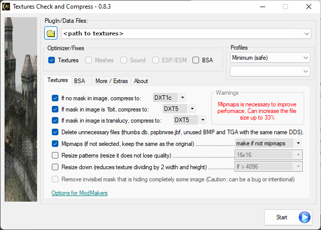

[<< Back to README](README.md)

# Utilities

These are programs that are either necessary for this mod list or very helpful in modding and troubleshooting in general. Personally, I have MO2 in my **Modding** Folder and the rest in a **Modding Tools** directory within the same folder.

## Necessary

### Mod Organizer 2([MO2](https://www.nexusmods.com/skyrimspecialedition/mods/6194?tab=files), [OpenMW Plugin](https://www.nexusmods.com/morrowind/mods/45642?tab=files))
For modding I use Mod Organizer 2, this is the method I recommend because it is the neatest and allows the user to more easily tweak their mod list as well as run third party programs crucial to a functioning load order. 

For OpenMW I use the [**ModOrganizer-to-OpenMW**](https://www.nexusmods.com/morrowind/mods/45642*) plugin made by AnyOldName3 to export my mod list and load order to `openmw.cfg`. 

For those that are new to Mod Organizer 2 I recommend reading [**this**](moddingBasics.md) document before continuing.

*Do not manually install mods, I will be very disappointed in you.*

### [Mlox](https://github.com/rfuzzo/mlox) ([Latest Rules](https://github.com/DanaePlays/mlox-rules/tree/main))
This is for analyzing and sorting your load order using a set of ordering rules.

Add to your **MO2** executables list and be sure to add the path to your **Data Files** folder in the **Start in** field otherwise mlox may not be able to find your plugins. 

When you run mlox for the first time it will create an `mlox_base.txt` file in `C:\Users\<your user name>\AppData\Local\mlox\mlox`, this directory is where the latest `mlox_user.txt` (link above) will go. If you have the latest version of mlox, the fork from rfuzzo💜, the latest user and base files will be automatically updated for you every time mlox is launched so it is no longer necessary to download the rules manually.

Mlox also parses a third file with personal rules that override the other files (order goes base>user>my_rules). I have added a few rules for my mod list in my personal rules file [**here**](config/mlox_my_rules.txt). Put this file in the same folder as your `mlox_base.txt`, if you choose to use it of course.

### [TES3Merge](https://www.nexusmods.com/morrowind/mods/46870) ([.NET 6 Runtime](https://dotnet.microsoft.com/en-us/download))
A tool for automatically patching conflicts between mods by merging objects and levelled lists. For a more detailed description refer to the Nexus page.

Add to your **MO2** executables list. To avoid needing to either run mlox a second time or manually move your merged plugin, there are some exclusions you can add to your `TES3Merge.ini`; 

Navigate to your TES3Merge directory and open `TES3Merge.ini` in a text editor.

Add the following to your `TES3Merge.ini`:
```
[FileFilters]
BCOM_pathgrid_reset.esp=false
BCOM_Canal_02.ESP=false
BCOM - Taller Lighthouse.ESP=false
BCOM_Suran Expansion.ESP=false
BCOM_White_Suran.ESP=false
BCOM_Izi_Hlaalu_plaza.ESP=false
Interior exterior flag reset.esp=false
BCOM_OpenMW_plazas.esp=false
POST_merge_VFWE_patch.esp=false
VFWE_merged_objects_fix.esp=false
```

Thank rfuzzo for these exclusion rules I shamelessly copied from him.

### [Morrowind Code Patch](https://www.nexusmods.com/morrowind/mods/19510) **[*Original Engine Only*]**
Patches bugs in the Morrowind program, which cannot otherwise be fixed by editing scripts or data files. Cures many crash and save corruption problems.

Download manually and run the installer; Direct the installer to your Morrowind installation.

Run `Morrowind Code Patch.exe` in your Morrowind directory.

### [MCP Skunk Works](https://www.nexusmods.com/morrowind/mods/26348)
Beta version of MCP. Download manually and extract the contents of the archive into your Morrowind directory, overwriting when prompted.

### [MGE XE](https://www.nexusmods.com/morrowind/mods/41102) **[*Original Engine Only*]**
A graphics improvement add-on to the Morrowind engine, for longer viewing distances, great sunsets, fine shaders and better lighting. Supports MWSE 2.1, included as part of the installer, so that the newest Lua gameplay mods work straight away.

Download manually and run the installer; Direct the installer to your Morrowind installation.

Add to your **MO2** executables list.

### [Wrye Mash Polemos Fork](https://www.nexusmods.com/morrowind/mods/45439) 
Wrye Mash is another mod manager, made specifically for Morrowind, but we won't be using it to manage mods with this list. Install location is irrelevant, as you will tell Wrye Mash where to find your Morrowind directory during the installation process. Make sure you download the beta 6 version and enable the 1024 max plugin limit in the advanced settings.

Add to your **MO2** executables list.

## Not Technically Necessary But Still Recommended

### [dxvk-async](https://github.com/Sporif/dxvk-async/releases/download/1.10.1/dxvk-async-1.10.1.tar.gz) **[*Original Engine Only*]**
A Vulkan-based translation layer for Direct3D 9/10/11

- Open the archive with 7zip
- Open the archive within the archive (hehe)
- Open the **x32** folder
- Put the `d3d9.dll` in that folder into your Morrowind directory
- Profit

### [Enchanted Editor](https://mw.modhistory.com/download-95-1662)
Powerful editor for plugins and saves.

### [TESPCD](https://mw.modhistory.com/download-95-5283)
For detecting conflicts between plugins, such as when two mods edit the same NPC or landscape in the same exterior cell.

### [Ordenador](https://www.nexusmods.com/newvegas/mods/46074?tab=description) ([.NET Framework 4.0](http://www.microsoft.com/download/en/details.aspx?id=17718))
Ordenador is for optimizing textures. 

Textures that need optimizing include:
- Uncompressed textures
- Textures lacking mipmaps (note that UI textures do not need mipmaps)
- Textures saved in the wrong compression format (should be DXT1 unless it has transparency, then it should be DXT5, *not* DXT3)

<details> <summary>Ordenador Settings</summary>

> 

</details>

### [7-Zip](https://www.7-zip.org/)
For opening archives, or making your own.

### [Notepad++](https://notepad-plus-plus.org/downloads/v7.9.5/)
A very handy plain text editor.

<br>

# Finally Some Mods

Before moving on to the mod installation be sure to get all of the necessary utilities installed and ready.

Click [**here**](modlist.md) to move on to the modlist.

<!--
for the full 300+ mod modlist.

Click [**here**](modlistbareminimum.md) for just the necessities.


# Before We Start... Again


-->
